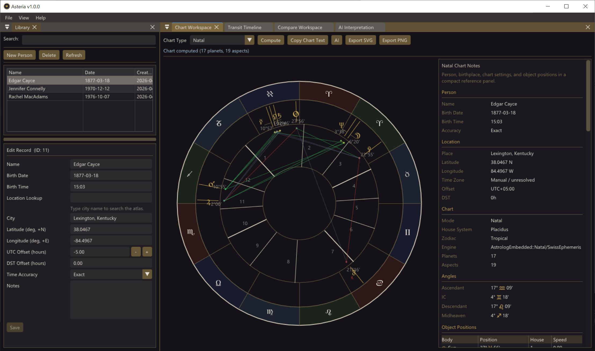
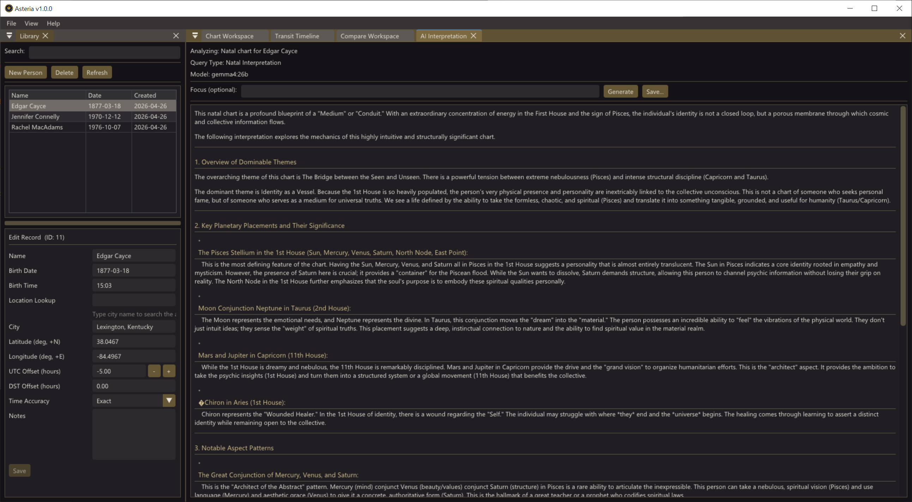

# Asteria

**A native Windows astrology application for power astrologers.**

Asteria is a fully-featured astrological charting desktop application built in C++ with an embedded [Astrolog](https://www.astrolog.org/) computation engine, Dear ImGui interface, and Swiss Ephemeris precision.

Copyright © 2026 Michael A. McCloskey. Licensed under the [GNU General Public License v2](LICENSE) (or later).

[](https://buymeacoffee.com/theosopher)

## Screenshots

### Main Workspace


### AI Interpretation


---

## Features

### Chart Computation
- **Natal charts** with Sun through Pluto, house cusps (Placidus, Koch, Whole Sign), and aspect grid
- **Synastry** bi-wheel with inter-aspect analysis
- **Composite** midpoint charts
- **Transit-to-natal** overlays with outer transit ring
- **Transit timeline** reports with configurable date ranges, planets, and aspects

### Interpretation
- Built-in deterministic interpretation engine with uncertainty guardrails
- Optional AI-powered interpretation via local [Ollama](https://ollama.com/) integration

### Export
- **SVG** vector export with deterministic, archival-quality output
- **PNG** rasterized export with reference sheet layouts
- Clipboard copy of chart text, chart SVG, chart images, AI interpretations, and AI packages with rich fallbacks
- PDF AI interpretation reports with report templates, optional vector chart drawing, archival metadata, and the chart used for generation

### Data Management
- SQLite database with person/birth-event CRUD
- Atlas with 20,000+ cities and timezone lookup
- Chart caching by canonical hash

### Automation
- Full CLI (`asteria_cli`) for scripted chart computation, export, and transit timeline generation
- JSON request file support for batch workflows

---

## Installation

### Installer
Download the latest `AsteriaSetup-x.y.z.exe` from [Releases](https://github.com/thetheosopher/Asteria/releases) and run it. The installer supports per-user or machine-wide installation with Start Menu and optional desktop shortcuts.

### Portable
Download the latest `Asteria-x.y.z-portable.zip` from [Releases](https://github.com/thetheosopher/Asteria/releases), extract it to any folder, and run `asteria_app.exe`.

---

## Building from Source

### Prerequisites
- **Windows 10/11** (x64)
- **Visual Studio 2022** (or later) with C++ desktop workload
- **CMake 3.23+**
- Internet access for FetchContent dependencies (Dear ImGui, SQLite, GoogleTest, cpp-httplib, libharu)

The checked-in `default` preset currently targets the Visual Studio 2022 generator (`Visual Studio 17 2022`).

### Build

```powershell
cmake --preset default
cmake --build build/default --config Release
```

### Run

```powershell
.\build\default\src\app\Release\asteria_app.exe
```

### Test

```powershell
cmake --build build/default --config Debug --target asteria_tests
ctest --test-dir build/default --build-config Debug
```

---

## CLI Usage

The automation CLI is built alongside the main application:

```powershell
# Compute a natal chart
.\build\default\src\automation\Release\asteria_cli.exe compute-natal --primary-datetime 1990-01-01T12:00 --primary-latitude 40 --primary-longitude -75 --primary-timezone -5

# Export SVG
.\build\default\src\automation\Release\asteria_cli.exe export-svg --chart-type natal --primary-datetime 1990-01-01T12:00 --primary-latitude 40 --primary-longitude -75 --primary-timezone -5 --output chart.svg

# Export an AI interpretation PDF report
.\build\default\src\automation\Release\asteria_cli.exe export-ai-report-pdf --chart-type natal --primary-datetime 1990-01-01T12:00 --primary-latitude 40 --primary-longitude -75 --primary-timezone -5 --interpretation-file interpretation.md --template client --output report.pdf

# Generate transit timeline
.\build\default\src\automation\Release\asteria_cli.exe generate-transit-timeline --natal-datetime 1990-01-01T12:00 --natal-latitude 40 --natal-longitude -75 --natal-timezone -5 --start 2026-01-01T00:00 --years 5 --output timeline.md

# Resolve a location
.\build\default\src\automation\Release\asteria_cli.exe resolve-location --query Denver
```

JSON request files are also supported with `--input <path>`. See `tools/examples/automation-cli/` for samples.

---

## Project Structure

```
src/
  app/          Main application entry point
  automation/   CLI tool
  core/         Services (natal, comparison, transit, interpretation, export, reports)
  data/         SQLite repositories and migrations
  domain/       Domain model (Person, BirthEvent, ComputedChart, etc.)
  engine/       Astrolog adapter and embedded engine
  render/       Chart scene, layout, SVG/PNG serializers
  ui/           Dear ImGui panels and application window
  util/         Atlas service, Ollama client
tests/          Unit and integration tests
third_party/    Vendored Astrolog source and Swiss Ephemeris
tools/          Build scripts, packaging, examples
docs/           Product specs and architecture docs
```

---

## License

Asteria is licensed under the [GNU General Public License v2](LICENSE) (or later), consistent with the embedded Astrolog engine.

See [NOTICES.txt](tools/packaging/NOTICES.txt) for third-party attributions.

---

## Support

- **GitHub:** [github.com/thetheosopher/Asteria](https://github.com/thetheosopher/Asteria)
- **Buy Me a Coffee:** [buymeacoffee.com/theosopher](https://buymeacoffee.com/theosopher)
